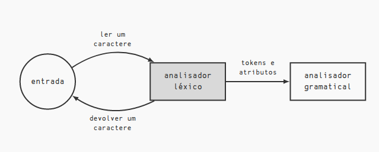

# Lexical Analyzer : class from the day 18/11/2022

## Interface for a Lexical Analyzer

<center>



</center>

Its important to notice that the token generated in the Lexical Analyzer will be inside a buffer, this buffer can be contained in various types of ways:

1. N(every token):
    * Advantage: independence;
    * Disadvantage: memory and the syntax errors will be detected later.

2. N = 1(one by one token):
    * Advantage: semantical errors will be detected earlier;
    * Disadvantage: dependence and synchronism.

3. Fixed M, 1 < M > N
    * Advantage: performance;
    * Disadvantage: implementation. 

## Defining token:

It is the indivisible unity tha makes the sentences ia a language.

* Important: **the sequence of chars that make a token is called a lexeme**

## Identifying integral constants

For each integral constant , the scanner will produce one token and one attribute, the token being the constant identifier and the attribute the value of the constant. So considering the entry:

```
3 + 14 + 15
```

The chain of tokens would be:

```
<num, 3> 
<+,> 
<num, 14> 
<+,> 
<num, 15>
```

Where in a pair <x, y>, the x would indicate a token and the y a attribute.
