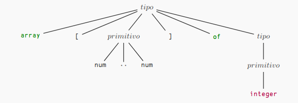

# Syntax Oriented Translation : class from the day 11/11/2022

## What is a Syntax Oriented Translation?

Uses the free context grammar to specify a syntactic structure and a semantic rule to produce. To make the translation you have to put into brackets the action. For example:

## The advantage of translating infixed to postfixed:

The advantage of this type of translation is that facilitate the implementation of operations with a stack.

## Top Down Analyzer 

The top down analyzer go from the root to the leafs. At the beginning start with a token, this token will be named *lookahead*, once this token is recognized the next token is passed to the *lookahead*. Example of the construction of a tod-down grammar tree:

* The predictive grammar analyzer will be a recursive function.

